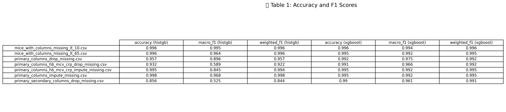
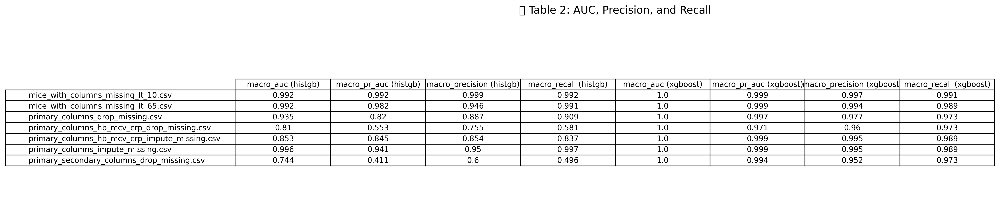
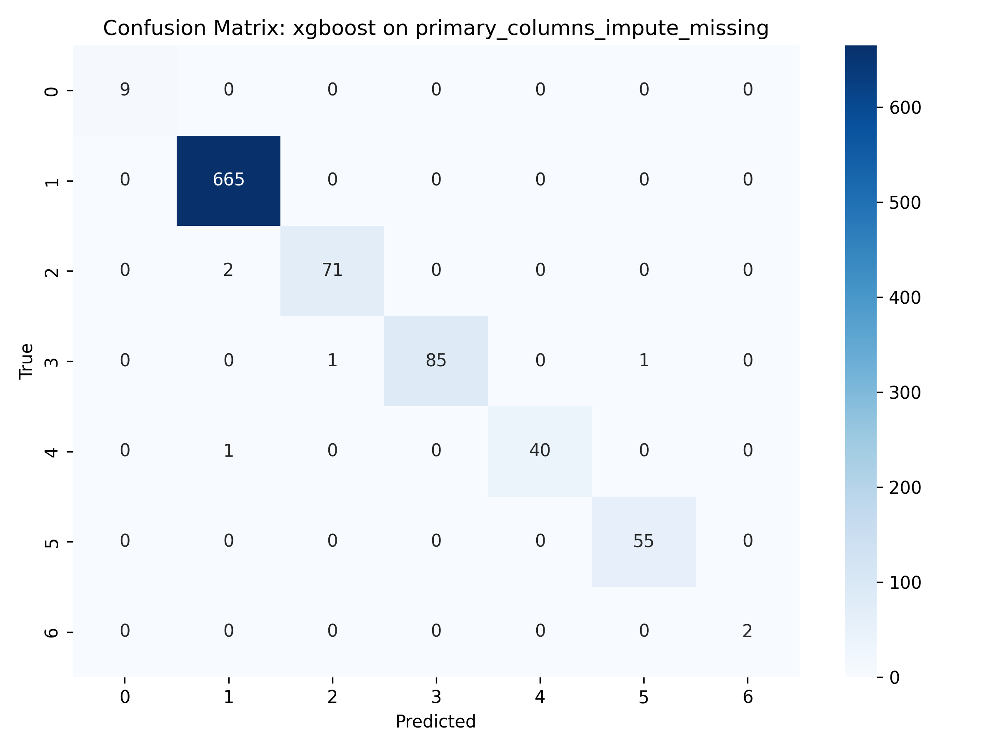
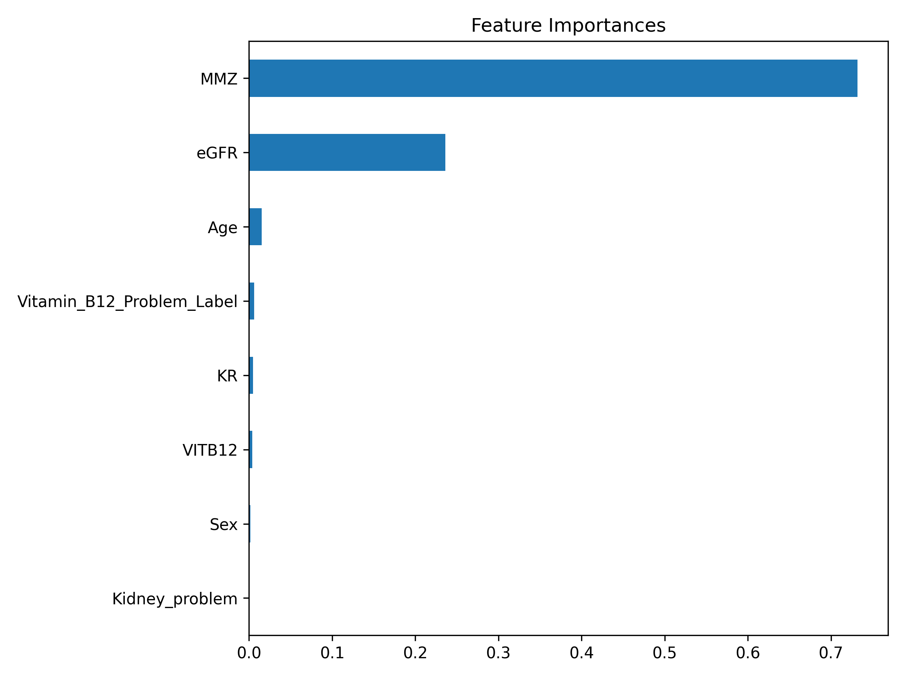
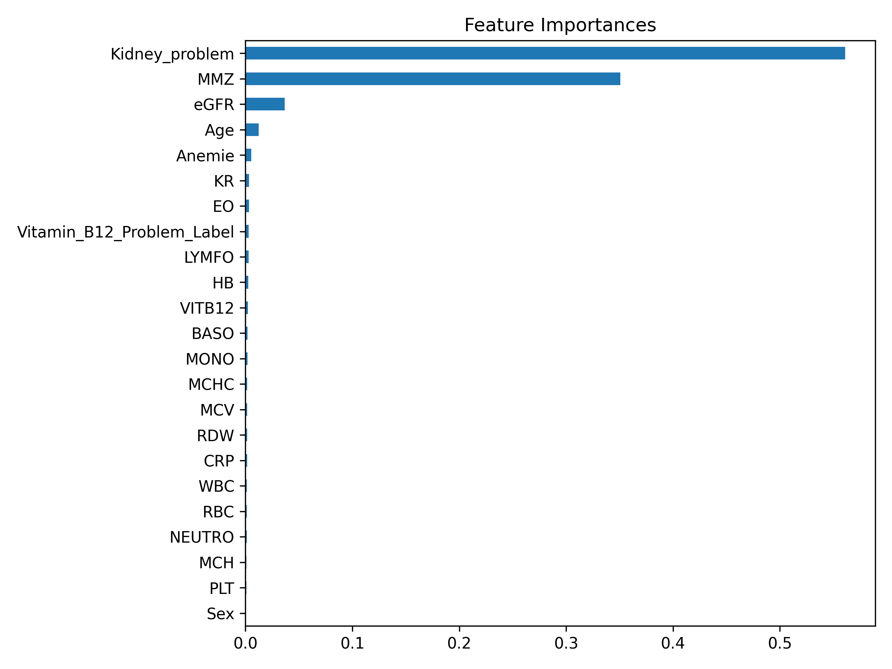
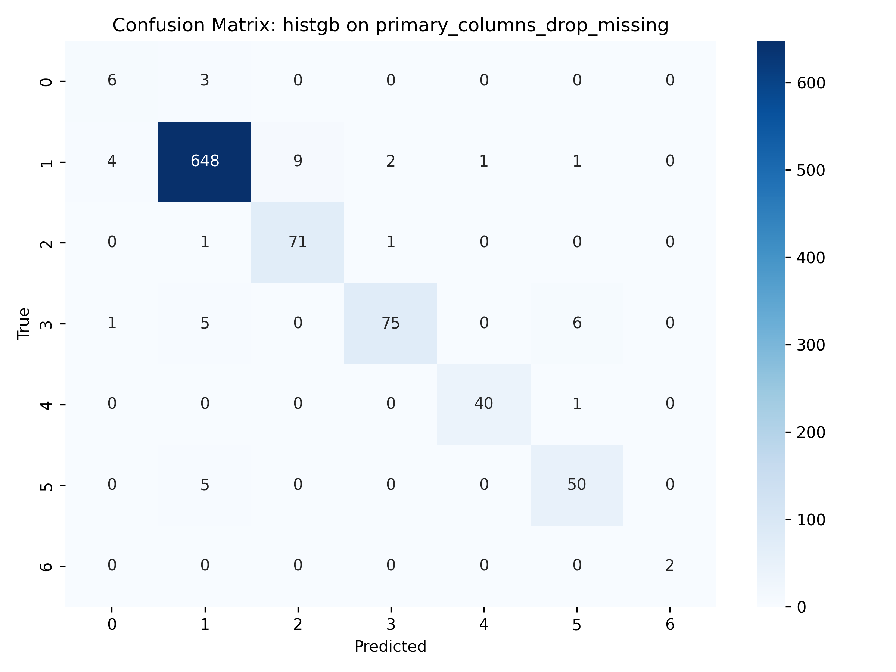

# Salmon-ai


---

## How to Run

### 1. Prepare Datasets

Place `labeled_MMA_data.csv` in the project root.

Then run all cells in:

```bash
DataPreparation.ipynb
```

This will generate all required CSVs for model training.

---

### 2. Train & Evaluate Models

To run all experiments:

```bash
python run_all_experiments.py
```

This script applies multiple models on all datasets and saves results to `ml_experiment_results.csv`.

---

### 3. Visualize Evaluation

To visualize the evaluation results (F1, Accuracy):

```bash
EvaluationResultsVisualization.ipynb
```

This will generate comparison plots and LaTeX-style tables for reporting.


## 📊 Metric Comparison Table





## 🔍 XGBoost Confusion Matrices




## 🧠 XGBoost Feature Importances




## 🔍 HistGB Confusion Matrices



