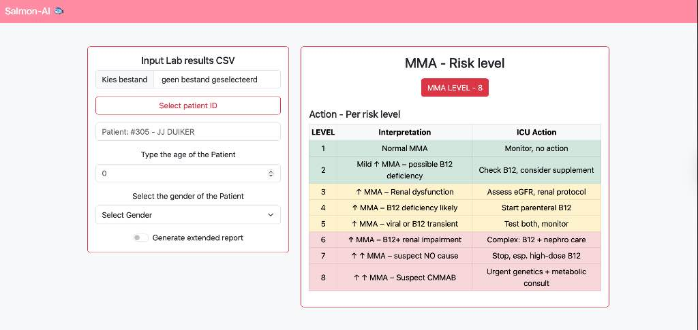

# Salmon-AI: MMA Risk Assessment

Last modified: June 8, 2024

## Table of Contents

  * [Introduction](#introduction)
  * [Features](#features)
  * [Usage](#usage)
  * [About the Project](#about-the-project)
  * [Feedback](#feedback)
  * [License](#license)

-----

## Introduction

Salmon-AI is a web-based front-end designed to interact with a machine learning model that assesses Methylmalonic Acid (MMA) risk levels. This application aims to provide **clinical decision support** in healthcare by interpreting lab results and offering actionable insights based on explainable AI methods.

-----

## Features

  * **CSV Input**: Easily upload patient lab results in CSV format.
  * **Patient Demographics**: Input patient age and gender for comprehensive analysis.
  * **MMA Risk Level Display**: Clearly presents the calculated MMA risk level.
  * **Actionable Insights**: Provides immediate actions to be taken based on the MMA risk level.
  * **Extended Report Generation (Planned)**: Option to generate detailed reports for in-depth analysis.

-----

## Usage

To use the Salmon-AI web application:

1.  **Upload Lab Results**: Click "Kies bestand" (Choose file) to upload your patient's lab results in CSV format.
2.  **Select Patient ID**: Use the "Select patient ID" button (functionality to be integrated with backend).
3.  **Enter Patient Information**:
      * Type the age of the patient in the designated field.
      * Select the gender of the patient from the dropdown menu.
4.  **View MMA Risk Level**: The "MMA - Risk level" section will display the calculated MMA level.
5.  **Review Actions**: Refer to the "Action - Per risk level" table for interpretations and immediate ICU actions corresponding to the determined MMA level.
6.  **Generate Extended Report (Optional)**: Check the "Generate extended report" switch if a more detailed analysis is required.

-----

## About the Project

This website serves as the front-end interface for an advanced machine learning project focused on the application of AI in healthcare. The underlying model has been meticulously developed to assess MMA-Risk levels based on various lab results. Our primary objective is to empower healthcare professionals with robust clinical decision support, leveraging the transparency and insights offered by explainable AI methodologies.

-----

## Feedback

Your feedback is invaluable in helping us improve Salmon-AI and address any bugs you might encounter. Please reach out to us via GitHub:

  * **Greete** – Bioinformatics Engineer
  * **Huseyin** – CTO
  * **Jarro** – Lead Data Scientist

-----

## License

This project is open-sourced under the [MIT License](https://www.google.com/search?q=LICENSE).